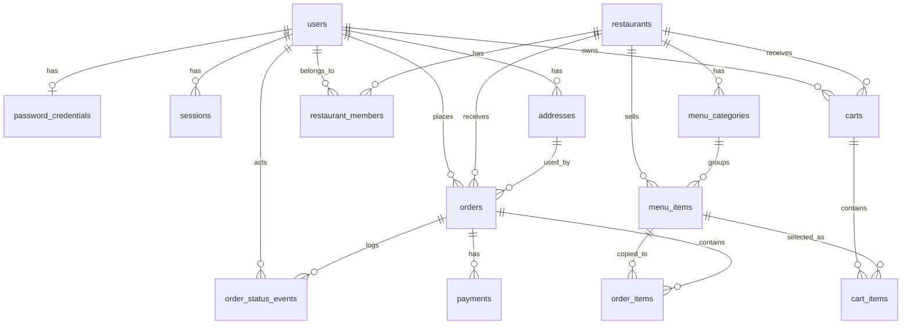

# 모락한끼 DB 구조 문서

## 개요

모락한끼는 Next.js 풀스택 앱이며, PostgreSQL 데이터베이스를 Prisma로 접근한다. 데이터는 크게 회원/인증, 식당/메뉴, 장바구니, 주문/결제 영역으로 나뉜다.

주문이 생성되면 장바구니의 데이터가 `orders`, `order_items`, `payments`, `order_status_events`에 저장되고, 기존 장바구니는 `ORDERED` 상태로 변경된다.

## DB 구조도

## 테이블 한줄 설명

| 테이블 | 설명 |
| --- | --- |
| `users` | 회원의 이메일, 닉네임, 전화번호, 권한 등 기본 계정 정보를 저장한다. |
| `password_credentials` | 이메일/비밀번호 로그인에 필요한 비밀번호 해시를 저장한다. |
| `sessions` | 로그인 상태를 유지하기 위한 세션 토큰 해시와 만료 정보를 저장한다. |
| `addresses` | 회원의 배송지, 수령인, 연락처, 기본 배송지 여부를 저장한다. |
| `restaurants` | 식당 이름, 주소, 영업시간, 최소주문금액, 배달비, 영업 상태를 저장한다. |
| `restaurant_members` | 특정 사용자가 특정 식당의 소유자/관리자/직원인지 연결한다. |
| `menu_categories` | 식당별 메뉴 카테고리와 정렬 순서를 저장한다. |
| `menu_items` | 식당 메뉴의 이름, 설명, 가격, 이미지 URL, 판매 가능 여부를 저장한다. |
| `carts` | 사용자의 활성 장바구니를 식당 단위로 저장한다. |
| `cart_items` | 장바구니에 담긴 메뉴, 수량, 담을 당시 단가를 저장한다. |
| `orders` | 주문 번호, 주문자, 식당, 배송지 스냅샷, 주문 금액, 주문 상태를 저장한다. |
| `order_items` | 주문 시점의 메뉴명, 단가, 수량, 줄 합계를 저장한다. |
| `payments` | 주문의 결제수단, 결제상태, 결제금액을 저장한다. |
| `order_status_events` | 주문 상태가 접수/배달중/완료/취소 등으로 바뀐 이력을 저장한다. |

## 주요 관계

| 관계 | 의미 |
| --- | --- |
| `users` 1 : N `sessions` | 한 사용자는 여러 로그인 세션을 가질 수 있다. |
| `users` 1 : N `addresses` | 한 사용자는 여러 배송지를 저장할 수 있다. |
| `restaurants` 1 : N `menu_categories` | 한 식당은 여러 메뉴 카테고리를 가진다. |
| `restaurants` 1 : N `menu_items` | 한 식당은 여러 메뉴를 판매한다. |
| `menu_categories` 1 : N `menu_items` | 한 카테고리에 여러 메뉴가 포함된다. |
| `users` 1 : N `carts` | 한 사용자는 여러 장바구니 기록을 가질 수 있다. |
| `restaurants` 1 : N `carts` | 장바구니는 식당 단위로 만들어진다. |
| `carts` 1 : N `cart_items` | 한 장바구니에는 여러 메뉴가 담긴다. |
| `users` 1 : N `orders` | 한 사용자는 여러 주문을 생성할 수 있다. |
| `restaurants` 1 : N `orders` | 한 식당은 여러 주문을 받을 수 있다. |
| `orders` 1 : N `order_items` | 한 주문은 여러 주문 상세를 가진다. |
| `orders` 1 : N `payments` | 한 주문은 결제 기록을 가질 수 있다. |
| `orders` 1 : N `order_status_events` | 한 주문은 상태 변경 이력을 여러 개 가진다. |

## 주문 시 데이터 저장 흐름

1. 사용자가 메뉴의 `담기`를 누르면 `carts`와 `cart_items`에 데이터가 저장된다.
2. 한 번에 한 식당의 메뉴만 주문할 수 있도록 장바구니의 `restaurantId`를 검사한다.
3. `주문하기`를 누르면 최소주문금액을 확인하고 배송지/요청사항/결제방법을 입력한다.
4. 주문 저장 시 `orders`에 주문 대표 정보가 생성된다.
5. 장바구니의 각 메뉴는 `order_items`로 복사된다.
6. 결제수단과 금액은 `payments`에 저장된다.
7. 첫 주문 상태 이력은 `order_status_events`에 저장된다.
8. 사용한 장바구니는 `carts.status = ORDERED`로 바뀐다.

## 테이블을 나눈 이유

| 분리한 테이블 | 분리 이유 |
| --- | --- |
| `orders` / `order_items` | 주문 대표 정보와 메뉴 상세는 1:N 관계라서 분리해야 중복 없이 여러 메뉴를 저장할 수 있다. |
| `carts` / `cart_items` | 장바구니 대표 정보와 담긴 메뉴 목록은 역할이 다르고, 메뉴 수량 변경이 잦아서 분리했다. |
| `payments` | 결제수단과 결제상태는 주문과 관련 있지만 독립적인 상태 변경이 가능해서 분리했다. |
| `order_status_events` | 현재 상태뿐 아니라 상태 변경 이력을 설명하기 위해 주문과 분리했다. |
| `menu_categories` / `menu_items` | 식당별 메뉴를 카테고리로 묶어 화면에서 필터링/정렬하기 위해 분리했다. |
