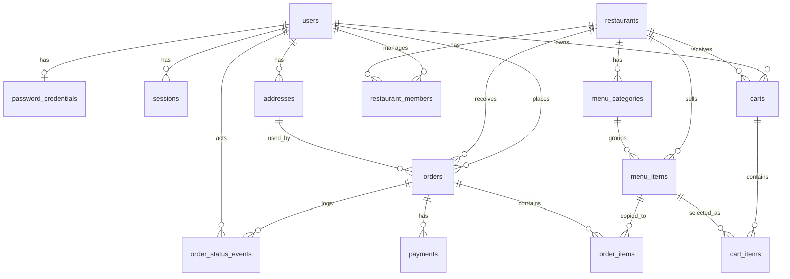

# 모락한끼 제출 문서

## 1. DB 구조도

모락한끼는 Next.js 풀스택 앱이며, PostgreSQL을 데이터베이스로 사용하고 Prisma로 접근한다. 데이터는 크게 회원/인증, 식당/메뉴, 장바구니, 주문/결제 영역으로 나누었다.

## 2. 테이블과 관계

| 테이블 | 한 줄 설명 |
| --- | --- |
| `users` | 회원의 이메일, 닉네임, 전화번호, 권한 등 기본 계정 정보를 저장한다. |
| `password_credentials` | 이메일/비밀번호 로그인에 필요한 비밀번호 해시를 저장한다. |
| `sessions` | 로그인 상태를 유지하기 위한 세션 토큰 해시와 만료 정보를 저장한다. |
| `addresses` | 회원의 배송지, 수령인, 연락처, 기본 배송지 여부를 저장한다. |
| `restaurants` | 식당 이름, 주소, 영업시간, 최소주문금액, 배달비, 영업 상태를 저장한다. |
| `restaurant_members` | 사용자와 식당을 연결해 소유자/관리자/직원 역할을 저장한다. |
| `menu_categories` | 식당별 메뉴 카테고리와 화면 정렬 순서를 저장한다. |
| `menu_items` | 메뉴 이름, 설명, 가격, 이미지 URL, 판매 가능 여부를 저장한다. |
| `carts` | 사용자의 활성 장바구니를 식당 단위로 저장한다. |
| `cart_items` | 장바구니에 담긴 메뉴, 수량, 담을 당시 단가를 저장한다. |
| `orders` | 주문 번호, 주문자, 식당, 배송지 스냅샷, 주문 금액, 주문 상태를 저장한다. |
| `order_items` | 주문 시점의 메뉴명, 단가, 수량, 줄 합계를 저장한다. |
| `payments` | 주문의 결제수단, 결제상태, 결제금액을 저장한다. |
| `order_status_events` | 주문 상태가 접수/배달중/완료/취소 등으로 바뀐 이력을 저장한다. |

주요 관계는 대부분 1:N이다. 예를 들어 한 사용자는 여러 주문을 만들 수 있고, 한 식당은 여러 메뉴와 여러 주문을 가질 수 있다. 예외적으로 `users`와 `password_credentials`는 1:1 관계이고, `users`와 `restaurants`는 `restaurant_members`를 사이에 둔 N:M 구조다.

주문 흐름은 다음과 같다. 사용자가 메뉴를 담으면 `carts`와 `cart_items`에 먼저 저장된다. 주문하기를 누르면 `orders`에 주문 대표 정보가 저장되고, 담긴 메뉴는 `order_items`로 복사된다. 결제 방법과 금액은 `payments`에 저장되며, 주문 상태 변화는 `order_status_events`에 기록된다. 주문 후 기존 장바구니는 `ORDERED` 상태가 된다.

## 3. 막혔던 지점 3개와 해결 방법

### 1) GitHub에 코드가 올라가지 않음

처음에는 `git push -u orgin main`처럼 `origin`을 잘못 입력해서 원격 저장소를 찾지 못했다. 이후에는 GitHub 비밀번호 인증을 시도해 `Password authentication is not supported` 오류가 발생했다. GitHub는 일반 비밀번호 대신 Personal Access Token 또는 GitHub CLI 인증을 사용해야 하기 때문이다. 해결 방법은 remote 이름을 `origin`으로 정확히 사용하고, GitHub 토큰으로 인증한 뒤 `git push -u origin main`을 실행하는 것이었다. 그 결과 로컬 프로젝트가 GitHub 저장소에 정상 업로드되었다.

### 2) 공개 URL이 계속 바뀌거나 접속되지 않음

개발 중에는 `localhost:3000`으로 확인했지만, 이 주소는 내 컴퓨터에서만 접속할 수 있다. 임시 터널 URL은 외부 접속이 가능하지만 터널이 끊기면 `No tunnel` 같은 오류가 발생하고 주소도 바뀔 수 있다. 해결 방법은 로컬 개발, 임시 공유, 최종 배포의 역할을 구분하는 것이었다. 로컬 확인은 Docker 기반 `make up`, `make down`으로 하고, 최종 제출용 공개 URL은 Vercel 배포 URL을 사용하도록 정리했다.

### 3) 장바구니 담기 후 화면 스크롤이 흔들림

영상 ③과 일치하는 문제는 메뉴의 `담기` 버튼을 누르면 화면이 맨 위로 올라가거나, 다시 내려오면서 사용자가 보던 위치가 바뀌는 현상이었다. 원인은 서버 액션 후 redirect가 발생하면서 브라우저 스크롤 위치가 초기화되고, 이후 추가한 스크롤 복원 로직이 너무 강하게 동작했기 때문이다. 해결 방법은 장바구니 액션을 클라이언트 폼 컴포넌트에서 처리하고, redirect 대신 `router.refresh()`로 데이터만 갱신하도록 바꾸는 것이었다. 전역 스크롤 복원 컴포넌트도 제거해 담기, 취소, 수량 변경 후에도 화면 위치가 자연스럽게 유지되도록 했다.

## 4. AI로 안 풀린 것 / 한계

AI는 코드 작성, DB 설계 정리, 오류 원인 추정에는 도움이 되었지만 모든 것을 자동으로 해결하지는 못했다. 특히 GitHub 토큰 입력, Vercel 계정 연결, Supabase/Vercel 환경 변수 등록처럼 실제 계정 권한이 필요한 작업은 사용자가 직접 해야 했다. 또한 임시 터널 URL은 AI가 열어줄 수 있어도 고정 배포 URL을 대신 보장할 수는 없어서, 최종 공개는 Vercel 배포 설정이 필요했다.

UI 문제도 한 번에 완벽히 해결되지는 않았다. 장바구니 스크롤 문제처럼 브라우저에서 직접 눌러보고 체감해야 하는 부분은 여러 번 수정과 확인을 반복해야 했다. 결국 AI는 방향과 코드를 빠르게 제안할 수 있지만, 실제 서비스처럼 동작하는지 확인하고 계정/배포 권한을 연결하는 과정은 개발자가 직접 검증해야 한다는 한계가 있었다.
